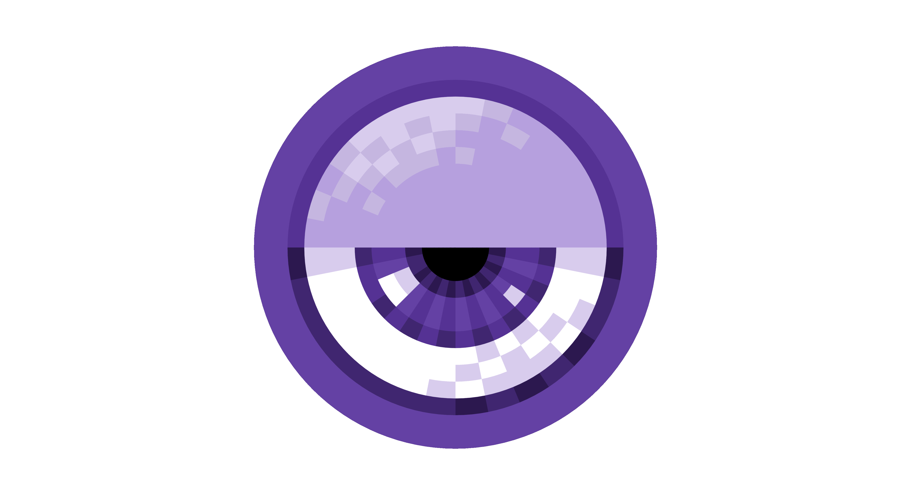

.. twitch-observer documentation master file, created by
   sphinx-quickstart on Thu Jun 29 21:01:11 2017.
   You can adapt this file completely to your liking, but it should at least
   contain the root `toctree` directive.

twitch-observer Documentation
=============================

.. image:: https://img.shields.io/badge/license-MIT-blue.svg?style=flat-square
   :target: https://github.com/JoshuaSkelly/twitch-observer/LICENSE
.. image:: https://img.shields.io/badge/python-2-blue.svg?style=flat-square
   :target: https://www.python.org/
.. image:: https://img.shields.io/badge/python-3-blue.svg?style=flat-square
   :target: https://www.python.org/

Turn Twitch chatter into Python events.

Features
========

- *Pure Python:* No extra dependencies. Just plain and simple Python.
- *Small API:* With three classes and twelve methods, you can learn it over a coffee break.
- *Event Based:* Makes writing apps easy and straightforward.
- *Context Manager:* Further simplifies working with observers.

.. toctree::
   :maxdepth: 2
   :caption: Contents:

.. automodule:: twitchobserver.twitchobserver

TwitchChatObserver
==================

.. autoclass:: TwitchChatObserver
   :members:

TwitchChatEvent
===============

.. autoclass:: TwitchChatEvent
   :members:

BadTwitchChatEvent
==================

.. autoclass:: BadTwitchChatEvent
   :members:

Indices and tables
==================

* :ref:`genindex`
* :ref:`modindex`
* :ref:`search`
